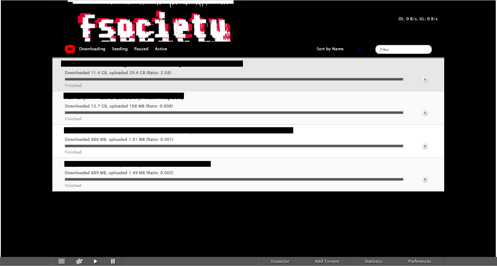

# kettu
Port of https://github.com/endor/kettu and the original Transmission Web Client
using [jquery](http://jquery.com), [sammy.js](http://github.com/quirkey/sammy) and [mustache.js](http://github.com/janl/mustache.js).

By najashark

## Screenshots
### Desktop

### Mobile

## Installation
You can use fsockettu instead of the original web client to remotely administrate your transmission application.

#### Linux
Without overwriting the default Web Interface, you can drop the fsockettu files into: `/usr/local/share/transmission/web`.

make sure backup the default Web Interface by using this :
`sudo mv /usr/local/share/transmission/web /usr/local/share/transmission/web.bak`

and then clone it 
`sudo git clone git://github.com/najashark/fsockettu.git /usr/local/share/transmission/web`

## Configuration
fsockettu supports the easy selection of a predefined location to download your torrents to. Put locations into the  `config/location.js` configuration file. See `config/locations.js.example` for an example.

## Shortcuts
You can drag to select multiple torrents. kettu also has a few hotkeys:

 - `Cmd/Ctrl+A` - select all
 - `Cmd/Ctrl+Backspace` - delete the selected torrents
 - `Cmd/Ctrl+Alt+Backspace` - delete finished torrents. A torrent is defined as finished if it has finished downloading and is paused.

## Revert
To revert back to the original Transmission web interface:

`sudo mv /usr/share/transmission/web.bak /usr/share/transmission/web`